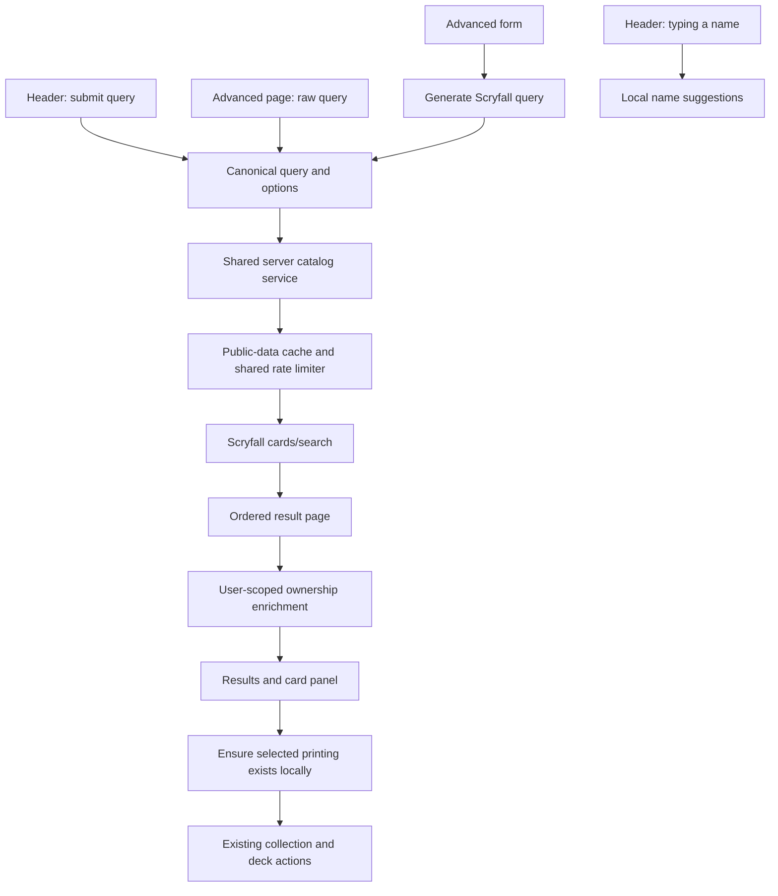

# Scryfall-compatible search: development guide for Project Upkeep

Prepared September 26, 2026. This is an implementation specification, not an implemented feature. Repository findings describe the code reviewed on this date.

## 1. Outcome and compatibility contract

A user must be able to copy a valid Scryfall query into either Upkeep's header search or `/search`, submit it unchanged, and receive results with the same query meaning. Advanced form controls must generate ordinary Scryfall queries and execute through the same service. A growing list of locally recognized operators is insufficient for this requirement.

The recommended design delegates submitted catalog searches to Scryfall and uses Upkeep's local database for name suggestions, ownership, friend availability, collection mutations, and deck mutations. Using the external API is a proposed architectural assumption; a requirement to search entirely locally would activate the substantially larger alternative in section 13.

There are three distinct acceptance targets:

| Target | Required behavior |
| --- | --- |
| Query compatibility | Preserve and execute the complete query language, including aliases, repeated clauses, Boolean expressions, regex, and future upstream operators. |
| Result compatibility | Preserve matching objects, upstream order, rollup mode, selected printing, and completeness through pagination. Never silently add a paper-only restriction. |
| Search experience compatibility | Support display directives and advanced controls; implement and verify the website conveniences described in section 8 before claiming the same website behavior. |

Scryfall documents `/cards/search` as using its main site's fulltext search system, while explicitly identifying some website-only behavior. Therefore, **calling the API alone does not establish complete website parity**. [Search API documentation](https://scryfall.com/docs/api/cards/search)

Scope covers catalog discovery through both web entry points and opening results in Upkeep. Collection-specific search, `/find`, scanning, and deck recommendations retain their separate purposes. Upkeep's branding and navigation remain its own; the goal is search compatibility, not copying Scryfall's visual identity.

## 2. Existing implementation and concrete gaps

| Existing location | Observed behavior | Required change |
| --- | --- | --- |
| `packages/upkeep-domain/src/card-search.ts` | Flattens a small syntax subset into one filter object. | Stop using this parser as the authority for submitted catalog queries. Keep only explicitly scoped local uses. |
| `src/lib/cards/search-query.ts` | Re-exports the shared parser and round-trips custom facet parameters. | Add a canonical query contract and a lossless legacy URL adapter. |
| `src/lib/cards/search.ts` | Searches local rows, excludes digital printings, fetches at most 2,000 rows, then groups by name and returns a slice. | Introduce a separate upstream catalog service; retain this code only for clearly labeled local functionality. |
| `src/app/api/cards/search/route.ts` | Routes plain names to an RPC and raw queries to the partial parser; returns unsupported clauses alongside partial results. | Separate suggestions from full submitted search. Return structured errors and upstream warnings. |
| `src/components/HeaderSearch.tsx` | Detects advanced queries through the partial parser, performs debounced local searches, and sends the typed query to ownership lookup as a name. | Submit every nonempty query through the canonical path. Enrich actual result identities after search. |
| `src/components/cards/AdvancedSearchForm.tsx` | Raw and structured forms are independent; submitting structured fields clears the raw query. | Generate one canonical query and prevent lossy transitions between raw and visual modes. |
| `src/app/(app)/search/page.tsx` | Ignores unsupported clauses, shows at most 90 results, and has no catalog pagination. | Render full search states, query options, totals, and navigation. |
| `src/components/cards/SearchResultsGrid.tsx` | Uses card name as the React key; opens a local printing ID. | Key by printing ID and support upstream printings absent locally. |
| `src/app/api/cards/[id]/route.ts`, `src/app/api/cards/printings/route.ts` | Details/printings require local rows; printing list excludes digital and is capped. | Add an upstream-backed read path and distinguish catalog browsing from physical-copy eligibility. |
| `src/lib/scryfall.ts`, `scripts/sync-scryfall.ts` | Map selected fields from `default_cards`; some scalar fields fall back to the front face. | Continue bulk sync for local product workflows; do not mistake it for a complete search index. |

Specific correctness failures to remove:

1. `t:legendary t:elf` retains only the last type clause; repeated numeric clauses such as `mv>=2 mv<=4` overwrite rather than intersect.
2. OR, parentheses, exact-name syntax, negation, identity, legality, prices, tags, regex, and many aliases cannot be represented faithfully by the existing filter.
3. Color overlap is an invalid prefilter for `c<=rg`: it excludes colorless cards before application matching. Searching `c:c` also tries to overlap the stored colors array with `C`, although colorless usually has an empty colors array.
4. The 2,000-row fetch limit can discard matching cards before filtering and grouping. Result counts and printing counts derived from that slice are incomplete.
5. Digital exclusion changes queries such as `game:arena`. Name grouping changes `unique:prints` and `unique:art`; sorting everything by name discards requested order.
6. Front-face scalar fallback does not implement search semantics across all card faces.
7. Unsupported operators can produce plausible but incorrect results instead of a clear failure. The current “Not understood, so ignored” behavior must disappear from full search.

## 3. Architecture



Use a server-only module such as `src/lib/cards/scryfall-search.ts`. The route handler and server-rendered search page call this module directly; the page should not make an HTTP request back to its own API. Authentication, public catalog retrieval, and private enrichment have separate boundaries.

Suggested responsibilities:

- `packages/upkeep-domain/src/catalog-search.ts`: framework-free request/result contracts, URL serialization, builder-to-query generation, and a narrow presentation-directive reader.
- `src/lib/cards/scryfall-search.ts`: upstream requests, list/error decoding, warnings, caching, pagination, and documented website fallback policy.
- `src/lib/cards/search-enrichment.ts`: batched, user-scoped annotations by IDs returned from search.
- `src/lib/cards/ensure-printing.ts`: server-only validation and idempotent local import needed by an add action.
- `src/app/api/cards/suggestions/route.ts`: fast local name suggestions.
- `src/app/api/cards/search/route.ts`: canonical submitted catalog search. Migrate its existing callers before changing its response shape.

Do not build a second semantic search engine in the browser. Do not select local or upstream execution based on which operators the old parser recognizes. **Plain names submitted with Enter also use upstream search.** Local suggestions are a preview convenience, not the authoritative result set.

The installed Next.js version has repository-specific instructions. Before implementation, read the relevant files under `node_modules/next/dist/docs/`; in particular, `01-app/03-api-reference/03-file-conventions/route.md` and `page.md`. Preserve asynchronous `searchParams`/route params conventions. Specify cache behavior deliberately rather than relying on assumptions about GET or fetch defaults.

## 4. Query transport and service contract

### Canonical request

Use `/search?q=<encoded-query>` as the shareable result URL. `/search` with no query opens the search editor. Proposed API:

```text
GET /api/cards/search?q=<encoded-query>&page=1
```

Optional presentation overrides: `unique`, `order`, `dir`, `display`, `prefer`, `include_extras`, `include_multilingual`, and `include_variations`. The latter three should use explicit booleans, not truthiness of strings. Validate page as a positive integer. Validate known control values separately from raw query syntax.

Requirements:

- Preserve the raw query's case, punctuation, Unicode, quotes, backslashes, braces, regex whitespace, clause order, and internal whitespace. Trimming whitespace at the outside is acceptable; rewriting the interior is not.
- Encode exactly once with `URLSearchParams`. Round-trip literal `+`, `&`, `#`, `/`, `\\`, and quotes; never concatenate the query into a URL manually.
- Enforce the currently documented limit of **1,000 Unicode characters**, counting code points rather than UTF-16 units. Reject overlong input with a clear message; do not truncate it. [Search API parameters](https://scryfall.com/docs/api/cards/search)
- Empty submitted input opens the editor without an upstream call. A local suggestion minimum must never prohibit a valid short submitted query.
- Send raw syntax to upstream as `q`. Unknown future keywords must reach upstream; the browser's vocabulary must not reject them first.
- Treat raw query plus display options as one search specification. Page navigation, retry, back/forward, refresh, copied links, and recent searches must preserve it.
- Existing `raw=` links remain valid and normalize to `q=`. Existing custom facets are translated once to equivalent query clauses. For legacy links with both raw and facets, preserve today's raw-wins rule; do not merge hidden fields unexpectedly.
- A legacy URL's `cmc=gte:3` is an Upkeep facet parameter, not Scryfall text; translate it to `mv>=3`.

### Option precedence

Inline directives remain authoritative over separate defaults. A live probe combining `order:released direction:asc` with API parameters `order=name&dir=desc` returned release-date ascending results. Preserve upstream precedence rather than trying to sort the page locally.

Defaults apply only where the query has no equivalent directive. Changing a results control must update the existing directive, or add one where absent, and reset page to 1. It must not leave a contradictory directive behind. For duplicate or unusually placed directives, retain raw text and let upstream interpret them; show controls as query-controlled until this behavior is verified.

`display` is a local renderer choice, not an API search parameter. `prefer` is a query directive, not a documented standalone API parameter; controls generate a `prefer:` clause. `sort:` occurs in Scryfall's own examples and must also be forwarded. Query-level order values can exceed the standalone API parameter enum; do not reject valid raw syntax because a dropdown is smaller.

A narrow lexical reader may identify presentation directives outside quoted values and regex literals. It must retain source offsets and original text. It must never strip a string such as `o:"display:text"` or a regex containing `order:`. Uncertain parsing must leave the query intact. This reader is not the filter evaluator.

Presentation vocabulary to cover at the reviewed reference version:

- `unique:cards`, `unique:prints`/`++`, `unique:art`/`@@`.
- `display:grid`, `display:checklist`, `display:full`, `display:text`.
- `order:` values: artist, cmc, power, toughness, set, name, usd, tix, eur, rarity, color, released, spoiled, edhrec, penny, review, imageupdated. Forward raw values even where the standalone API parameter or Upkeep dropdown is narrower.
- `prefer:` values: oldest, newest, currency-low/currency-high for usd/eur/tix, promo, default, atypical, universesbeyond/ub, notuniversesbeyond/notub; also `best`, observed in the reference advanced form. Test actual printing selection, not just HTTP acceptance.
- `direction:asc`, `direction:desc`; separate API `dir=auto` leaves direction to upstream.

### Proposed result envelope

```json
{
  "status": "ok",
  "submittedQuery": "t:elf unique:prints",
  "effectiveQuery": "t:elf unique:prints",
  "source": "scryfall",
  "page": 1,
  "totalCards": 123,
  "hasMore": false,
  "nextPage": null,
  "warnings": [],
  "fallbackApplied": null,
  "fetchedAt": "2026-09-26T12:00:00Z",
  "stale": false,
  "presentation": { "display": "grid" },
  "cards": []
}
```

Values above illustrate shape, not a measured count. Card records must preserve printing `id`, nullable `oracle_id`, name, printed/flavor names where present, language, games, set/number, release date, prices, layout, faces, images, and the upstream card link. Reuse upstream object definitions or maintain a validated adapter; the existing bulk-import type is not a complete API type. Retain fields needed for checklist/text/full views.

Scryfall list metadata includes `data`, `has_more`, `next_page`, nullable `total_cards`, and optional warnings. Do not fabricate unavailable totals. [List objects](https://scryfall.com/docs/api/lists)

Return a discriminated error shape with `kind`, safe `message`, upstream status/code/type where available, warnings, and retry timing when applicable. Never expose credentials or internal SQL errors.

## 5. Syntax coverage and acceptance inventory

The [official syntax reference](https://scryfall.com/docs/syntax) is the source of truth. The table below defines Upkeep coverage and test obligations; it is not a replacement syntax tutorial. Each row requires aliases, valid values, comparisons, negations where applicable, and combinations with other rows. An API-backed implementation forwards these intact. A local implementation must maintain the complete vocabulary and semantics.

| Coverage group | Representative fixture | Upkeep-specific requirement |
| --- | --- | --- |
| Loose, quoted, exact and negative names | `!"Sol Ring"`; `-ring t:artifact` | Never classify exact-name searches as ordinary local substring lookup. Match card/face identities as upstream returns them. |
| Boolean composition and nesting | `t:legendary (t:elf or t:goblin)` | Preserve grouping, implicit conjunction, repeated clauses and OR case variants. |
| Card colors and color identity | `id<=abzan c!=g`; `c=2`; `c:c` | Identity and colors are different concepts. No overlap prefilter. Test named color sets and colorless. |
| Types | `t:legendary t:elf -t:artifact` | Every clause applies; partial type matching follows upstream. |
| Oracle and full Oracle text | `o:"draw a card"`; `fo:"reminder text"` | Do not substitute Upkeep's front-face scalar column or reminder-text policy. |
| Ability keywords | `kw:flying -t:creature` | Distinguish keyword membership from text substring search. |
| Mana symbols and cost comparison | `m:{W/U}`; `m>{2}{G}` | Keep braces, hybrid, Phyrexian, snow, colorless and variable symbols intact. |
| Mana value, parity, devotion, produced mana | `mv:odd`; `devotion:{G}{G}`; `produces=wu` | Do not translate symbolic costs to numeric mana value. Include legacy aliases such as `cmc`. |
| Stats and stat-to-stat comparison | `pow>tou`; `pt>=6`; `loy=3` | Do not invent numeric interpretations for missing or symbolic statistics. |
| Layouts and multiple faces | `is:mdfc`; `is:meldpart` | Search all relevant faces; render the returned layout correctly. |
| Card classes and effect criteria | `is:permanent`; `is:modal`; `is:outlaw` | Preserve upstream criteria rather than approximate type checks. |
| Extras and funny cards | `t:scheme`; `include:extras` | Do not hide matching objects merely because Upkeep cannot add a physical copy. |
| Rarity and rarity history | `r>=r`; `in:rare -r:rare`; `new:rarity` | Current-print rarity and print history are separate operations. |
| Sets, blocks, groups, set types, collector numbers | `e:lea cn<=20`; `g:fin`; `st:masters`; `in:lea` | Preserve set aliases, historical membership, and nonnumeric collector numbers. |
| Cubes | `cube:vintage t:artifact` | Upstream cube membership must not be replaced with a locally guessed list. |
| Legality and commander roles | `f:modern`; `banned:legacy`; `restricted:vintage`; `is:commander` | Live legality is separate from card type or ownership. |
| Rankings, reserved status, game changers | `edhrecrank<=100`; `is:reserved`; `is:gamechanger` | Do not substitute stale or absent local fields. |
| Currency and cheapest-print selection | `usd<5`; `cheapest:eur`; `tix>=1` | Currency, null pricing, selected printing and website behavior require fixtures. |
| Artist, flavor, watermark and illustration history | `a:"John Avon"`; `has:watermark`; `new:art`; `illustrations>1` | Search metadata and history rather than rendering fields alone. |
| Frames, borders, finishes, stamps, image quality | `border:borderless`; `frame:1997`; `is:etched`; `stamp:acorn`; `is:hires` | A search criterion can match a printing with multiple available finishes. |
| Games, promos, spotlights, Universes Beyond | `game:arena`; `in:mtgo`; `is:promo`; `not:universesbeyond` | Remove unconditional paper-only/digital exclusion from catalog search. |
| Dates and years | `date>now`; `date>ori`; `year<=1994` | Relative dates are evaluated upstream; cache freshness must account for them. |
| Art and Oracle tags | `art:squirrel`; `function:removal` | Forward tag names and aliases; do not infer tags from rules text. |
| Reprint and print/set counts | `is:reprint`; `paperprints>2`; `papersets=1` | Use catalog history, not the count of fetched or owned rows. |
| Languages and language history | `lang:ja`; `lang:any`; `in:ru`; `new:language` | Local `default_cards` coverage must not constrain upstream results. |
| Land families and other shortcuts | `is:fetchland`; `is:surveilland` | Support all upstream nicknames and aliases without a client allowlist. |
| Negation forms | `-is:reprint`; `not:reprint`; `-not:reprint` | Forward exact expressions; do not convert a leading hyphen to a literal name fragment. |
| Regex and extensions | `o:/\sm/`; `name:/\bring\b/`; `o:/~ enters/` | Preserve regex source, escaped slashes, and Scryfall-specific extensions. |
| Rollup, display, order, preference, direction | `unique:art display:full order:released prefer:oldest direction:asc` | Distinguish result selection from rendering. Include shorthand directives `++` and `@@`. |
| Advanced-form generated syntax | `lore:urza prefer:best` | Observed on the reference form; include even when absent from the short syntax table of contents. |

No local JavaScript regex execution is necessary for the recommended architecture. If local execution is chosen, implement the documented regex dialect and extensions; matching with arbitrary JavaScript regex will not establish compatibility. [Regex reference](https://scryfall.com/docs/regular-expressions)

## 6. Header search experience

The header should make submitted syntax reliable without sending upstream requests on every keystroke.

1. Keep a clearly labeled search input, Search submit affordance, Advanced link, and Syntax help link. Retain Cmd/Ctrl-K. On smaller screens, open a usable search sheet or navigate to `/search` with the current draft preserved.
2. Enter with no intentionally selected suggestion submits the whole query. Enter must work before any debounce completes. Do not automatically select a suggestion when results arrive.
3. Arrow keys select local name suggestions; Enter on an intentionally selected card opens that card. Escape closes suggestions. Tab preserves ordinary keyboard navigation.
4. Provide an always available “Search all cards for this query” action. Suggestions may be limited; submitted results must not be limited to those suggestions.
5. Local suggestions may run after a short debounce for simple names. For syntax, show the submission action and syntax help; an exact cache hit may show a labeled preview. Do not present local partial parsing as a complete syntax preview.
6. Query suggestions can help insert operators and symbols, but must never replace or autocomplete query text without user selection. Optional; not a release dependency.
7. Clear stale suggestions and errors when input changes. Abort obsolete requests and use a generation ID so an old response or `finally` cannot replace current results or loading state.
8. Preserve the submitted query in the result URL and editor. Recent searches should replay the complete query and applicable options, not a simplified filter object.
9. Implement accessible combobox/listbox relationships, selected option announcements, visible focus, a persistent label, and polite loading/error announcements. Verify IME composition does not trigger accidental submission.

Collection and friend annotations must be derived from the returned card IDs/Oracle identities in a batched request. Passing `t:elf f:commander` to a literal-name ownership search is not meaningful. Annotations cannot filter, reorder, or hide catalog results.

## 7. Advanced search experience and query builder

The raw query is always available on `/search`. The visual builder is a convenient way to produce that same language, not a competing source of truth.

Required builder groups, aligned with the [reference advanced form](https://scryfall.com/advanced):

| Group | Controls and serialization requirements |
| --- | --- |
| Names and text | Name, exact-name toggle, rules text, full Oracle option, and symbol insertion. Separate phrase mode from all-words mode. |
| Types | Multiple included/excluded types; partial matching mode. Generate separate clauses, not a single concatenated type string. |
| Colors | Five colors plus colorless; exact, includes, at most. Represent colorless as `c:c`, not literal membership in a stored `C` array. |
| Commander identity | Separate identity controls; ordinary deck identity restriction generates `id<=...`. |
| Mana cost | Exact mana-cost mode with symbol insertion; optional comparison selector. |
| Statistics | Repeatable field/comparator/value rows for mana value, power, toughness, loyalty and total stats. Permit both ends of a range. |
| Games | Include/exclude paper, Arena, MTGO; combine selected alternatives explicitly. A visible paper preset is acceptable, a hidden catalog restriction is not. |
| Formats | Repeatable legal, banned and restricted status rows; current format vocabulary. |
| Sets | Sets, blocks/groups, set types and collector numbers. Multiple sets use grouped OR. |
| Rarity | Multiple selections with grouped OR; permit special/bonus through extended controls or raw syntax. |
| Criteria | Include/exclude searchable criteria with current vocabulary and partial matching behavior verified against the reference form. |
| Prices | Repeatable currency/comparator/value rows; decimals and missing-price behavior. |
| Art, flavor and lore | Artist, flavor text, lore; preserve phrase versus word behavior. |
| Language | Default, explicit language, any language. Never silently replace a requested language with English. |
| Result preferences | Unique cards/prints/art, four display modes, sort/direction, printing preference and extras. |

Implementation rules:

- Maintain a builder model with arrays of clauses/groups, not one slot per filter. Generate a query deterministically, show a read-only preview, then submit the preview text through the same service as raw input.
- Parenthesize disjunctions. For example, selected Elf/Bird alternatives produce `(t:elf or t:bird)`; legendary plus Elf uses `t:legendary t:elf`.
- Quote and escape text values deliberately. Verify escaping against upstream; do not assume JSON string escaping equals Scryfall escaping. All-words text mode generates separate clauses, whereas phrase mode generates one quoted clause.
- Never treat regex entered in a plain-text field as executable syntax implicitly. Offer an explicit raw/regex path.
- A query generated by the builder must produce the same result identities/order as pasting its preview into the header.
- Parse raw text into form fields only when a supported conversion can round-trip without semantic loss. Otherwise keep raw mode active and explain that the visual fields cannot represent that expression.
- Do not silently clear regex, nested OR, exclusions, tags, repeated clauses or unknown operators when opening or editing the builder. A separate “Start a new search” action may reset the query visibly.
- Keep search input and builder state through failed requests. A result URL remount should restore the actual query; navigating back should restore the prior submitted search and options.
- Populate sets, symbols and available vocabulary from cached upstream metadata where available. Version maintained option lists where the API does not expose a vocabulary. Unknown raw values still reach upstream.
- Test reference-form defaults before declaring builder parity. The observed default form generated `(game:paper)` and `prefer:best`; the raw header must not acquire either restriction implicitly.

## 8. Results, display directives and website conveniences

### Core results

- Preserve upstream order and selected printings. Never regroup by `name`, substitute Upkeep's newest printing, or apply an alphabetical sort afterward.
- Render grid, checklist, text, and full-detail modes. A valid `display:text` query must visibly choose text mode. Display mode changes should reuse fetched public data when possible.
- Provide unique cards, all prints, unique art, sort and direction controls. Printing preferences must change upstream selection rather than pick from one already fetched page.
- Use printing ID for keys; support identical names across different printings, tokens, art-series objects, and multiple game objects. Treat nullable Oracle IDs and face-level IDs according to layout.
- Support images stored on individual faces, missing images, flip/rotate controls, and appropriate layouts. Keep full-card aspect ratios and copyright/artist information visible. [Image usage rules](https://scryfall.com/docs/api)
- Show authoritative result totals when available, current range, loading state, warnings, retry state, and empty state. Do not label the number of items rendered as the total number matched.
- Do not reuse the existing `printing_count` as an upstream total. An actual “all printings” count requires its own appropriately cached lookup or should be omitted.

### Pagination

The API currently returns up to 175 cards per search page. Use upstream continuation metadata; never impose the existing 30/90-result or 2,000-row limits on submitted search. [Search API](https://scryfall.com/docs/api/cards/search)

Recommended first version: expose one upstream page per Upkeep result page. Use `has_more` for Next and carry the exact effective query/options into every request. Avoid inventing a 60-card browser page by repeatedly fetching/discarding upstream pages. A 60-card presentation is possible later with an explicit cached pagination adapter.

Expose app page numbers or an opaque validated cursor. Do not accept arbitrary client-provided upstream URLs. If following `next_page`, allow only HTTPS, `api.scryfall.com`, the expected search path, and valid server-generated query parameters. Reset to page 1 when query-affecting controls change. Fetch only requested pages; never recursively load the whole catalog just to render one screen.

### Website behavior beyond the API

The following are documented upstream differences and must be tracked separately from query parsing:

| Website behavior | Upkeep requirement |
| --- | --- |
| No-result retries widen coverage | After a genuine zero-match response, implement a tested fallback sequence for extras and languages. Keep submitted and effective query separate; display the expansion and preserve it across pages. |
| Set-only searches open a set gallery | Detect only an unambiguous positive set-only query. Provide the corresponding all-printings gallery behavior and show the effective mode. Other expressions containing set clauses are ordinary searches. |
| Suggestions expand coverage | Offer contextual actions, including relevant changeling/all-printings suggestions, without applying them invisibly. |
| Some price searches change displayed printings | Verify representative website queries and encode an explicit policy. A price filter alone must not be assumed equivalent to `cheapest:` or `prefer:`. |
| Spelling assistance | Offer suggestions while keeping the original query recoverable. The search API itself does not supply this behavior. |

The API's “Missing Luxuries” section describes these differences but does not specify a complete algorithm. [Documented differences](https://scryfall.com/docs/api/cards/search#missing-luxuries)

Fallback implementation must not override an explicit `lang:` restriction, explicit extras exclusion, or another deliberate scope without an obvious user-facing state. Run fallback only for no matches, never for malformed syntax, authentication, rate limits or transport failure. Bound the attempt count; each retry consumes the same shared upstream budget. Verify whether the website's second fallback retains the first expansion before copying its sequence.

The initial release can be described as “supports Scryfall search syntax” after query/result tests pass. It must not claim an identical Scryfall website experience until the convenience policies above have been characterized and verified. Spelling and price-printing behavior are explicit research gates, not assumed capabilities of the API.

## 9. API operations, cache and error requirements

### Requests and traffic

Current published limits are **2 search requests per second, spaced 500 ms apart**, with separate endpoint limits. HTTP 429 triggers a 30-second access restriction according to the current rate-limit documentation. Do not rely on older blanket advice about 10 requests per second. [Current rate limits](https://scryfall.com/docs/api/rate-limits)

- Implement a shared limiter for all deployment instances and request paths, including server pages, route handlers, pagination, fallbacks and background work. A per-component debounce or per-process counter is insufficient on Vercel.
- Use a search budget below the ceiling, spaced at least 500 ms apart; bound queue length and wait time. Account conservatively for other application traffic and any shared upstream limits observed in testing.
- Set an identifying `User-Agent` such as `ProjectUpkeep/<version> (<contact>)` and `Accept: application/json`; use HTTPS. These headers are required by the API. [API rules](https://scryfall.com/docs/api)
- Do not call upstream for every keystroke, every ownership annotation, every image, or every card in a batch. Use local bulk data and batched enrichment for those workflows.
- On 429, open a shared cooldown for at least 30 seconds, extended by a longer `Retry-After` if provided. Surface a retry state; do not immediately loop through retries.
- Apply bounded timeouts and response validation. For transient upstream failures, use at most a small bounded retry with backoff through the shared limiter; do not retry 400 or no-match responses as transport failures.
- Query cancellation prevents stale UI updates. It does not undo a request already received by upstream, so request coalescing and caching remain necessary.

### Caching

- Cache public catalog responses with a key containing the exact effective query, all query-affecting parameters, page, and search-policy version. Do not key on a flattened filter or normalized internal whitespace.
- Coalesce identical in-flight requests. Cache no-match results for a bounded interval; do not cache transient failures as empty searches.
- Separate rendering-only state where it does not affect the selected result objects. Keep display metadata synchronized even when using cached cards.
- Start with a 24-hour public-data cache and explicit invalidation around catalog refreshes; mark stale responses and fetched time when serving stale data on failure. Scryfall encourages caching downloaded data for at least 24 hours. [Caching guidance](https://scryfall.com/docs/api/rate-limits)
- Cache relative-date queries with an appropriate upstream-date bucket and invalidate at the relevant day boundary. Cached price/legality/ranking results reflect their retrieval time; provide an intentional refresh policy.
- Cache only public results globally. Keep ownership, private deck membership, friend permissions and session-dependent responses outside shared caches. Session checks must run even on a cache hit.
- Measure cache hit rate, queue delay, upstream latency, response codes, fallback use and warnings. Avoid recording complete raw searches or private annotations in routine telemetry.

### Error states

| Condition | Required user experience |
| --- | --- |
| Invalid local request shape or overlong query | Clear validation message; preserve draft; no upstream call. |
| Upstream syntax error | Display safe upstream details and warnings; preserve the entire query; never execute a reduced version. |
| Confirmed no matching cards | Normal empty search state and applicable website fallback policy. Distinguish this from an unknown endpoint/printing 404. |
| Successful list with warnings | Show warnings prominently as possible compatibility limitations; do not claim the result fully honors every requested condition. |
| 429/cooldown | Retry timing and preserved query; optionally display explicitly marked stale data. |
| Network failure, 5xx, bad upstream payload | Search unavailable with retry; retain draft and previous results with clear stale/loading labeling. |
| Session expired | Existing sign-in flow with query preserved. |
| Ownership enrichment failure | Keep catalog results visible; mark annotations unavailable. |

Upstream errors expose status, code, details, optional type and warnings; map those deliberately. [Error objects](https://scryfall.com/docs/api/errors)

## 10. Integrating upstream cards with Upkeep actions

Upstream matches may include newly previewed cards, non-English printings, digital cards or extras absent from the local mirror. Search completeness cannot depend on local foreign keys.

1. Render the upstream card immediately using its validated card object.
2. Opening a result must support its exact printing even when `/api/cards/[id]` finds no row. Use cached public data or an upstream lookup under the appropriate limit. Handle deleted/migrated IDs explicitly.
3. Before adding a supported printing to a collection, want list or deck, ensure the canonical local card row exists. Existing `card_instances.card_id` and `deck_cards.card_id` reference `cards.scryfall_id`.
4. On a missing local row, validate the ID and fetch trusted upstream data server-side. Use the existing mapping/upsert machinery where suitable. Do not accept a client-supplied card object as trusted catalog data.
5. Make import and retry idempotent, including simultaneous adds and scheduled syncs. Use the sanctioned server-side catalog writer; privileged credentials must remain server-only. Existing user-action authorization and RLS still apply.
6. Imported rows must preserve languages, layout and finishes. Review Oracle FK/face-ID handling against the current schema; a nullable or face-level Oracle ID needs deliberate treatment rather than a fabricated value.
7. Apply physical-copy and deck eligibility rules to actions, not to discovery. A digital-only match can be viewed while an unsupported physical add is disabled with a specific explanation.
8. Preserve a matching printing when opening the panel. A separate printing switcher may offer other versions, but should not replace the selected result silently.
9. Annotate exact-print ownership separately from “you own another printing.” Use Oracle/gameplay identity where applicable and printing ID for exact versions. Never infer equality from name alone.
10. Friend availability follows existing permissions and sharing rules, returned in a batch after public search. Avoid a database/API request per result tile.

Keep the scheduled bulk sync. An upstream search service supplements it; it does not replace the local catalog needed by the rest of the product.

## 11. Implementation sequence

| Milestone | Deliverables | Exit condition |
| --- | --- | --- |
| A. Compatibility spike | Public query fixtures; inline-option precedence; warnings/no-match mapping; rare sorts/preferences; builder serialization; website price/fallback characterization. | Unsupported or ambiguous behavior is recorded explicitly before a parity claim. |
| B. Shared service | Contracts, server adapter, public cache, shared limiter, errors and upstream pagination. | Raw queries arrive unchanged; no-result, warnings and rate limiting work under concurrency. |
| C. Entry-point migration | Separate suggestions; header submit; raw advanced search; canonical URLs; legacy adapter. | Every submitted query uses the same execution path from both surfaces. |
| D. Rendering and local integration | Four views, rollup/order/preference controls, card panel fallback, batched enrichment, ensure-printing path. | Missing local cards remain visible/openable; supported adds succeed with correct identity. |
| E. Visual builder | Complete control groups, deterministic query generation and lossless mode transitions. | Generated queries match header execution and raw text is never discarded implicitly. |
| F. Website conveniences and release | Verified fallbacks, set gallery, suggestions, price policy, accessibility, traffic/load checks and documentation. | Acceptance matrix passes for the chosen compatibility claim. |

Release behind a feature flag. The legacy path may remain available for rollback, but must not silently replace full syntax execution on failure. If upstream is unavailable, show the defined unavailable/stale state. A labeled local-only tool may be offered separately.

Repository change checklist:

- Review all imports/callers of the existing parser and `/api/cards/search`, including mobile and add-card flows, before changing contracts.
- Avoid changing collection filter semantics while migrating global search.
- Version recent-search storage if it changes from query strings to full search specifications.
- Remove outdated comments, placeholders, and subtitles claiming complete catalog coverage from capped local paths.
- Reuse existing image/face rendering and panel actions where compatible; expand the result model rather than force upstream records into name-grouped `CardSearchResult`.
- Document new operational configuration: user-agent/contact, cache store, shared limiter, request timeout, queue limit and feature flag. No Scryfall API key is required.
- Update the relevant README and developer notes after implementation, including behavior when external search is unavailable.

## 12. Verification and release criteria

### Automated verification

Use fixtures and a mocked upstream server for routine CI. Keep live parity checks opt-in, sequential and cached; they must respect the current traffic rules.

1. **Transport fidelity:** round-trip `o:"draw a card"`, `o:/\sm/`, braces, escaped `/`, literal `+`, `&`, Unicode names, newlines inside values, exact names, and shorthand directives. Assert no clause is dropped and no internal whitespace changes.
2. **Entry-point equivalence:** for every syntax family, submit the identical query through the header and raw advanced form; compare request text, options, ordered printing IDs and error/warning states.
3. **Builder equivalence:** serialize every control and representative combinations; compare ordered upstream results with the same generated query pasted into the header. Include multiple sets/rarities, exclusions, quoted phrases and numeric ranges.
4. **Legacy URLs:** `raw=`, bare `q=`, custom facets, mixed raw/facets, reload, back/forward and recent-search replay.
5. **Metadata and identity:** printing/Oracle IDs, nullable IDs, exact back-face names, multi-faced cards, same-name distinct objects, multilingual/digital/extras and missing local rows.
6. **Pagination:** a fixture with more than one page; totals, continuations, page reset, no skipped/duplicated page boundaries, and query/options preserved. Do not assert live fixed counts that change with new releases.
7. **Control semantics:** inline versus parameter precedence, `sort:` aliases, all display/unique modes, preferences, and quoted/regex occurrences of directive names that must not affect controls.
8. **Failure states:** invalid syntax, no matches, warnings, 429, malformed JSON, 5xx, timeout, expired auth, missing cache, failed enrichment and missing/migrated printing.
9. **Operations:** multiple simultaneous users/instances, shared spacing and cooldown, request coalescing, bounded queues, cancellation and stale response races.
10. **Privacy and mutations:** no cached user annotations across accounts, friend visibility enforcement, untrusted import rejection, concurrent ensure-printing and authorized/idempotent add actions.

For deterministic query compatibility, compare Upkeep's adapter output with a recorded upstream response for the same exact specification. For selected live samples, compare ordered IDs across all fetched pages to contemporaneous upstream responses. Website checks additionally compare visible mode, representative printing selection and fallback behavior; the website may paginate differently.

Minimum regression queries include:

```text
t:legendary t:elf
mv>=2 mv<=4
t:legendary (t:elf or t:goblin) -c:r
c<=rg
c:c t:artifact
id<=esper f:commander
!"Lightning Bolt" unique:prints
o:"~ enters tapped"
o:/\sm/ t:creature
pow>tou
game:arena
lang:any unique:prints
art:squirrel
function:removal
in:lea -e:lea
new:rarity
cheapest:usd prefer:oldest
t:forest unique:art display:text
lore:urza prefer:best
t:artifact order:released direction:asc
```

Add one fixture per coverage row, aliases, malformed versions and combinations; this list alone is not the full acceptance suite. Include broad queries that would have exceeded the old 2,000-row cap. Confirm an exact-name query can return a card with that name on a face instead of assuming a top-level name equality.

### Manual verification

- Desktop and mobile: typing, paste, Enter before debounce, selected-suggestion Enter, Escape, arrows, Cmd/Ctrl-K, touch, IME, clear/reset and back navigation.
- Keyboard and screen reader: labels, focus management, announced result counts/errors, disabled actions and all display modes.
- Slow/offline upstream: preserved draft, canceled response races, visible stale state and retry recovery.
- Multi-faced and missing-image results; large printing searches; non-English and digital results; newly previewed card absent locally.
- Website convenience fixtures: exact retry sequence, deliberate language scope, set-only browsing and representative price-selected printings.

After implementation run the repository's relevant checks:

```bash
npm run lint
npm run typecheck
npm test
npm run test --workspace=@upkeep/domain
npm run build
# If schema/RLS/import migrations changed:
npm run test:db
```

Update tests in `scripts/search-query.test.ts`, `packages/upkeep-domain/test/card-search.test.ts`, and recent-search suites to reflect which behavior remains local. Add meaningful adapter, builder and end-to-end coverage; do not rewrite unrelated parser tests merely to suggest complete syntax support.

### Definition of done

- Both input surfaces execute the same submitted query without partial interpretation.
- All documented syntax families are exercised, including aliases and combinations; upstream warnings remain visible.
- Completeness is preserved through pagination; no local hard cap, name grouping, paper filter or hidden sort changes the answer.
- Display/rollup/order/preference directives work and controls preserve raw syntax.
- Builder-generated searches are equivalent, and arbitrary raw searches survive builder interaction.
- Results absent locally open correctly and supported actions resolve local FK requirements safely.
- Shared upstream limits, cache boundaries and failure states pass realistic concurrent checks.
- The product states its actual compatibility level. Any unverified website conveniences remain named limitations rather than an “identical Scryfall” claim.

## 13. Alternative: entirely local search

Choose this only if external query execution is unacceptable or independent/offline catalog search is a product requirement. It is a search-engine project, not an extension of the current regular-expression tokenizer.

Required work:

1. A lexer that preserves source spans and handles quotes/escapes, regex delimiters, symbols, negation, exact names, comparators, parentheses, shorthand directives and name text.
2. An expression tree representing conjunction, disjunction, negation, repeated clauses, scalar/field comparisons and presentation options. Establish actual precedence and every special case through fixtures; do not infer grammar solely from examples.
3. A semantic registry for all aliases, operators, values, defaults, nicknames and selection rules. Unknown syntax must fail clearly rather than be ignored. Version the supported upstream reference and track changes.
4. A data model covering Oracle/gameplay objects, printings, all faces, games, languages, legality, prices including TIX, ranks, sets/blocks/groups, card migrations, reprint history, illustration identity, finishes, promos, frames/stamps, tags and cubes.
5. Full multilingual data: `default_cards` is not every-language coverage. Use `all_cards` where complete print/language search is required. Current bulk files also expose Art Tags and Oracle Tags; consume their documented join models instead of assuming those datasets are unavailable. [Bulk data documentation](https://scryfall.com/docs/api/bulk-data)
6. An ingestion and freshness policy for all source datasets, plus any curated vocabulary or cube membership not available in chosen exports. Coverage must be demonstrated, not inferred from a JSON column.
7. Indexed/parameterized query planning, complete evaluation before rollup, stable global sorting and pagination. No application-side capped prefilter that can omit matches. Apply query execution budgets without silently returning incomplete answers.
8. Correct handling of null/symbolic stats, colorless sets, identity versus colors, reminder text, self-name expansion, multi-face semantics, language defaults, extras, print history and ranking/price selection.
9. A compatible bounded regex executor, including documented extensions and multiline/Unicode behavior. Guard against expensive expressions without pretending another regex dialect is equivalent.
10. A continuous differential suite against Scryfall for every family, edge case and alias, with licensed/permitted data usage and an operational update owner.

Local results can differ because of dataset age even if the evaluator is correct. Publish the sync time and supported syntax version. Do not claim full parity until the evaluator, data coverage and selection policy all pass the same acceptance contract.

## 14. Evidence and remaining decisions

Reviewed official references through the browser because the text fetcher received HTTP 403:

- [Scryfall home](https://scryfall.com/) and [syntax reference](https://scryfall.com/docs/syntax)
- [Advanced search](https://scryfall.com/advanced)
- [Search endpoint](https://scryfall.com/docs/api/cards/search), [lists](https://scryfall.com/docs/api/lists), [errors](https://scryfall.com/docs/api/errors)
- [Rate limits](https://scryfall.com/docs/api/rate-limits), [API rules](https://scryfall.com/docs/api), [regex](https://scryfall.com/docs/regular-expressions), [bulk data](https://scryfall.com/docs/api/bulk-data)

Two read-only live API probes succeeded with no warnings: an exact-name query including printing/display/preference directives, and a lore query including sort/direction/display/preference directives plus conflicting standalone sort parameters. The reference advanced form was submitted with `urza` in Lore Finder, confirming `lore:urza`, the paper default and `prefer:best` in its generated URL. These probes establish those observations only; they are not a completed parity suite. Display acceptance in JSON does not prove Upkeep renders the requested view.

Remaining implementation decisions: external versus local execution; shared cache/limiter store; supported add actions for digital/extras; and characterized policies for spelling assistance and website price-printing conveniences. Recommended defaults are external execution, explicit physical-action eligibility, and no claim of complete website parity before those convenience tests pass.

When implemented, preserve free access to card data, add Upkeep's collection/deck value, and follow upstream data/image rules. Do not present the integration as endorsed by Scryfall. [Usage requirements](https://scryfall.com/docs/api)
