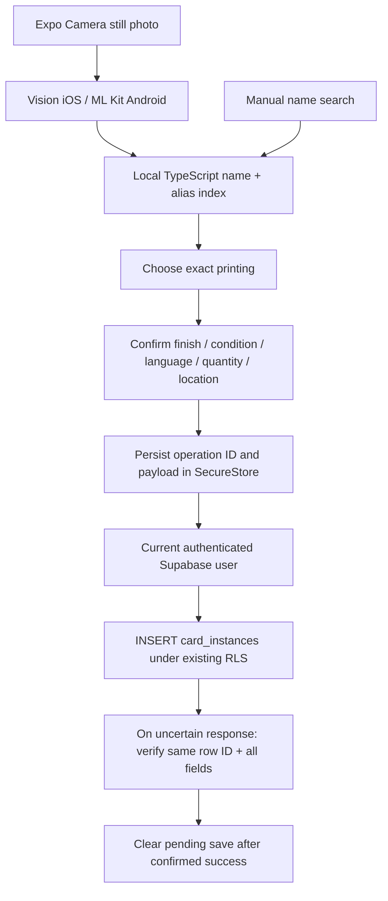

# Architecture and due diligence

## Current state (2026-09-18)

Everything below this section is the **2026-09-16 phase-one record** and is kept as history. The
current description of the app lives in [`.claude/rules/mobile.md`](../../../.claude/rules/mobile.md);
where the two disagree, that file wins. What has changed:

- **The app is no longer a single-file shell.** `App.tsx` is a thin shell (SafeAreaProvider -> fonts
  -> `AppProvider` -> `NavigationContainer` -> `RootShell`). React Navigation bottom tabs (Scan /
  Collection / Decks / Account, custom `TabBar`) with a nested native stack for Decks. State is in
  `src/AppProvider.tsx`, screens in `src/screens/`, shared UI in `src/components/`, tokens in
  `src/theme.ts`, the Mort mascot in `src/mort/`.
- **Scanning is live, not photo capture.** Superseded below: "Expo Camera still photo", "Capture is
  manual and single-flight", and "Recognition runs once per capture, not on every preview frame"
  (in QUALITY_REVIEW). `packages/upkeep-vision` now has a native iOS view, `UpkeepScannerView`,
  that runs its own AVCaptureSession, detects and outlines the card, and emits one finished read
  per physical card. It is **iOS only**; Android has no live scanning. `readText` and
  `compareArtwork` still exist; `compareArtwork` is unused by the screen.
- **Stage, then commit.** Scans no longer go through a per-scan review-and-save. They are staged in
  memory and written only on "Add to collection", row by row, through `apply_stack_addition`
  (migration 36). The "Persist operation ID and payload in SecureStore" step in the data-flow
  diagram below no longer happens for scans; a staged list is lost if the app is killed. Pending
  sleeve/unsleeve moves are still persisted and recovered.
- **Catalog.** The real ~40 MB catalog downloads automatically on first launch when only the
  3-card demo bundle is loaded; the download cap is 80 MB. `demo` mode is derived from the bundle
  version.
- **Writes are no longer "one row per scan".** See the stacking notes in `mobile.md`.

Historical record follows.

## Scope decision — 2026-09-16

The owner clarified that Project Upkeep currently has a **Next.js web app only**. This is the first mobile phase. The attached architecture document was treated as planning context, with its assumptions checked against source code. It was not used as authorization to publish, replace the web app, or modify a live database.

The implementation uses Expo SDK 55 / React Native 0.83, TypeScript, and an Expo Modules native library. Keeping the core package free of React/Expo imports lets it move into a future Upkeep monorepo or run in the web app. Expo native modules can also be consumed by a bare React Native app after installing Expo modules support.

## What the acquired app actually contains

| Question | Finding from source |
| --- | --- |
| On-device or API image matching? | Apple Vision `VNGenerateImageFeaturePrintRequest`; comparison is on-device, reference pictures downloaded from Scryfall. |
| Custom trained assets? | None found. `assets/` contains a confirmation sound, not a model or reference embedding corpus. |
| What is compared? | Up to 16 printings of a title already found by OCR. The captured rectangle is compared with full-card reference images. |
| Confidence? | Best feature-print distance must be < 90% of runner-up distance; no absolute-distance calibration. This is a ranking heuristic, not a probability. |
| Fallback trigger? | Artwork refines an already-recognized title. It cannot recover from completely missing OCR. |
| Backend? | Direct Scryfall requests plus local JSON files. No private recognition API, auth system, or collection backend found. |
| Android parity? | Original `MainActivity.kt` handles `detectCard` only. OCR/artwork methods return not implemented. New Android module adds bundled Latin-script ML Kit recognition. |
| Measured accuracy? | No labeled image corpus, precision/recall study, or foil/non-English benchmark found. Do not claim an accuracy percentage. |

Primary source paths: `ios/Runner/AppDelegate.swift`, `lib/src/recognition/data/card_text_reader.dart`, `lib/src/scanner/presentation/scanner_screen.dart`, and `android/app/src/main/kotlin/com/mtgscanner/mtg_card_scanner/MainActivity.kt`.

## Data flow

The scan-core pipeline also exposes `identifyImage` for a future global image model/service and `comparePrintings` for candidate refinement. Neither is secretly enabled; no captured image leaves the device in this build. `@upkeep/vision.compareArtwork` only accepts local reference files, with a 16-image limit. The app currently uses OCR + manual review. Integrating reference downloading is a separate, explicit next step.

## Safety and lifecycle properties

- Capture is manual and single-flight. No continuous camera frames cross the JS bridge.
- Backgrounding closes the camera and invalidates pending recognition results.
- Cancelling JS work does not release the native lock early; the owned temporary photo is deleted only after native OCR settles.
- All matches require review. Name equality never implies a particular printing, finish, or condition.
- Catalog names include Unicode normalization and aliases; Latin ML Kit does not imply support for recognizing Japanese/Chinese text.
- Catalog refresh uses a byte budget, request deadline, schema validation, and two alternating disk slots. A partial new slot leaves the previous valid slot available.
- In-progress collection save data is scoped to the signed-in user and retained across process death. No automatic background replay occurs: a pending save recovered after restart is shown for an explicit retry/verify tap, never resubmitted silently.
- Auth persists across restarts (phase 1, part b) via a SecureStore-backed `auth.storage` adapter in `src/backend.ts` — see the comment there for why the session blob's size is not a problem on this SDK version. Signing out clears both the persisted session and that account's pending-scan key. `signInWithPassword` is still the only auth path; password reset, OAuth, deep links and registration remain future mobile-shell work. No service-role key is used.

## SDK sources checked during implementation

- [Expo local native modules](https://docs.expo.dev/modules/get-started/)
- [Expo module API](https://docs.expo.dev/modules/module-api/)
- [Expo Camera](https://docs.expo.dev/versions/latest/sdk/camera/)
- [ML Kit Android text recognition](https://developers.google.com/ml-kit/vision/text-recognition/v2/android)

Actual dependency compatibility was checked against the installed Expo SDK's `bundledNativeModules.json`, not assumed from the planning document.
